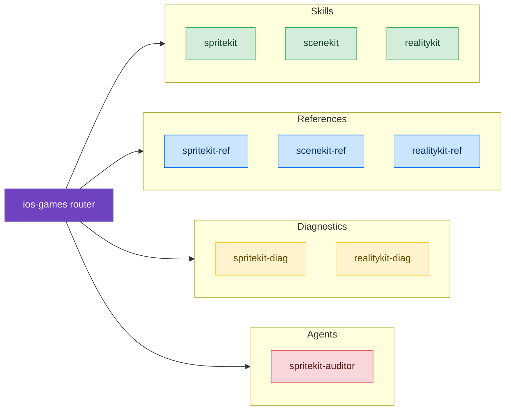

# Games

Skills for building games and interactive 3D experiences on Apple platforms using SpriteKit, SceneKit, and RealityKit.

## Available Skills

### SpriteKit

Complete guide to building 2D games with SpriteKit. Covers the scene graph model, physics engine (bitmask discipline, contact detection, body types), action system, game loop, performance optimization, and SwiftUI/Metal integration.

- [SpriteKit](/skills/games/spritekit) — Architecture, patterns, anti-patterns, and code review checklist

## Available Agents

- [spritekit-auditor](/agents/spritekit-auditor) — Scans SpriteKit code for physics bitmask issues, draw call waste, node accumulation, and action memory leaks

## Available References

- [SpriteKit API](/reference/spritekit-ref) — All 16 node types, physics body creation, complete action catalog, texture atlases, constraints, particles, SKRenderer

## Available Diagnostics

- [SpriteKit Diagnostics](/diagnostic/spritekit-diag) — Decision trees for contacts not firing, tunneling, frame drops, touch bugs, memory spikes, coordinate confusion, transition crashes

### SceneKit

3D scene graph framework for rendering, animations, and physics:
- [SceneKit](/skills/games/scenekit) — Scene graphs, materials, animations, SceneKit → RealityKit migration
- [SceneKit API](/reference/scenekit-ref) — Complete SceneKit API reference and concept mapping

### RealityKit

Entity-Component-System framework for AR and 3D content:
- [RealityKit](/skills/games/realitykit) — ECS architecture, entity-component patterns, RealityView
- [RealityKit API](/reference/realitykit-ref) — Entity, Component, System, materials, animations
- [RealityKit Diagnostics](/diagnostic/realitykit-diag) — Entity loading failures, physics issues, rendering problems

### Metal Migration

Porting OpenGL/DirectX rendering to Metal:
- [Metal Migration](/skills/games/metal-migration) — Migration patterns, shader conversion, rendering pipeline
- [Metal Migration API](/reference/metal-migration-ref) — Shader translation, pipeline state objects
- [Metal Migration Diagnostics](/diagnostic/metal-migration-diag) — Shader compilation, rendering artifacts

## Example Prompts

- "I'm building a SpriteKit game"
- "My physics contacts aren't firing"
- "Frame rate is dropping in my game"
- "How do I set up SpriteKit with SwiftUI?"
- "Objects pass through walls in my game"
- "Audit my SpriteKit code for issues"
- "How do I migrate from SceneKit to RealityKit?"
- "My RealityKit entities aren't loading"
- "I need to port my OpenGL renderer to Metal"
